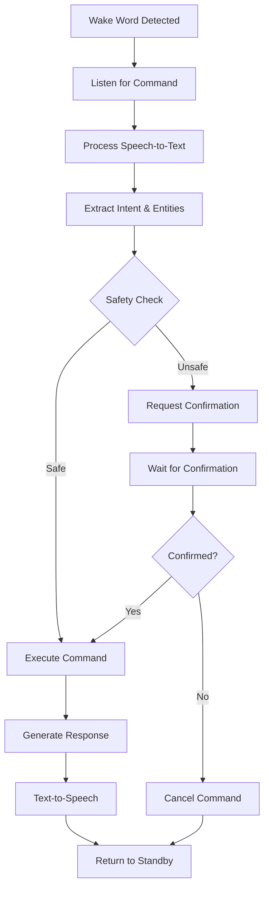
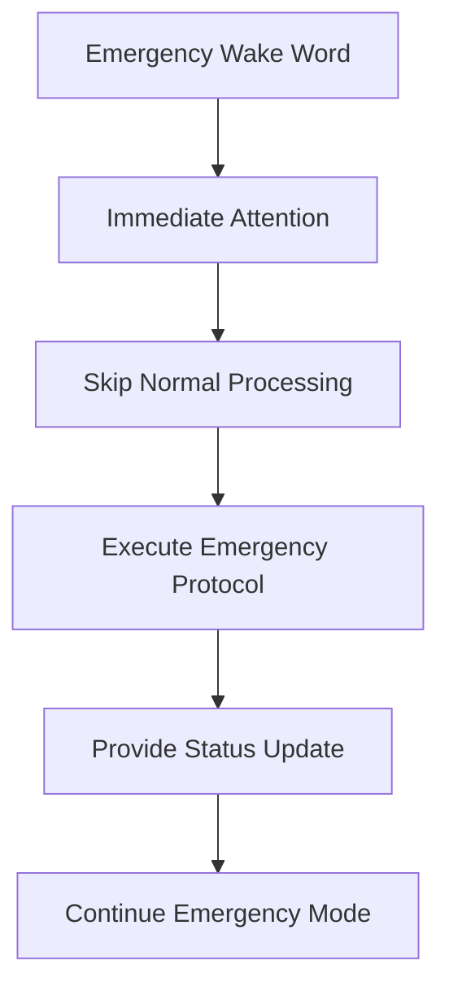

# Voice Interface Design

## Wake Word System

### Primary Wake Words
**"Hey Car"** (Primary)
- Simple, distinctive phonemes
- Low false positive rate
- Natural automotive context
- Easy pronunciation in noise

**"Vehicle Assistant"** (Secondary)
- More formal interaction mode
- Administrative functions
- System configuration
- Emergency protocols

**"Emergency Override"** (Critical)
- Immediate attention trigger
- Bypasses normal processing
- Direct safety protocol access
- Highest priority response

### Wake Word Detection Engine
**Picovoice Porcupine**
- Custom wake word training
- Low power consumption (< 1mW)
- Real-time processing capability
- Cross-platform compatibility

**Configuration Parameters**
```json
{
  "sensitivity": 0.7,
  "keywords": ["hey-car", "vehicle-assistant", "emergency-override"],
  "audio_sample_rate": 16000,
  "frame_length": 512,
  "detection_threshold": 0.8
}
```

## Speech Recognition Pipeline

### Audio Preprocessing
**Noise Reduction**
- Road noise filtering (100-2000 Hz)
- Engine noise suppression
- Wind noise reduction
- HVAC system noise filtering

**Audio Enhancement**
- Automatic gain control (AGC)
- Echo cancellation
- Voice activity detection (VAD)
- Multi-channel beamforming

**Hardware Integration**
```
Microphone Array → Raspberry Pi 5 → Hailo AI Accelerator
     ↓                    ↓                ↓
  Raw Audio         Preprocessing    AI Processing
  48kHz/24-bit      16kHz/16-bit    Real-time STT
```

### Speech-to-Text Engine
**OpenAI Whisper (Base Model)**
- Optimized for automotive environment
- Hailo AI acceleration integration
- Real-time streaming capability
- Multi-language support potential

**Performance Targets**
- Latency: < 200ms processing time
- Accuracy: > 95% in clean conditions
- Accuracy: > 85% with road noise
- Wake-to-response: < 500ms total

### Audio Capture Configuration
```python
AUDIO_CONFIG = {
    "sample_rate": 16000,
    "channels": 4,  # Multi-mic array
    "bit_depth": 16,
    "chunk_size": 1024,
    "buffer_duration": 3.0,  # seconds
    "vad_threshold": 0.3
}
```

## Natural Language Understanding

### Intent Recognition
**Core Intents**
- `climate_control`: HVAC system management
- `lighting_control`: Interior/exterior lighting
- `engine_management`: Performance and diagnostics
- `audio_control`: Media and volume
- `vehicle_status`: Information requests
- `emergency_action`: Safety and emergency
- `system_config`: Settings and preferences

**Intent Classification Examples**
```
"Turn up the heat" → climate_control + increase + temperature
"Dim the dashboard lights" → lighting_control + decrease + dashboard
"What's my engine temperature?" → vehicle_status + query + engine_temp
"Play some music" → audio_control + activate + media
"Emergency stop all systems" → emergency_action + stop + all
```

### Entity Extraction
**Numeric Entities**
- Temperature values (°F/°C)
- Percentage values (0-100%)
- Speed values (MPH/KPH)
- Pressure values (PSI/bar)

**Temporal Entities**
- "in 5 minutes"
- "after we stop"
- "when engine is warm"
- "before we arrive"

**System Entities**
- Component names (engine, transmission, HVAC)
- Zones (front, rear, driver, passenger)
- Modes (auto, manual, sport, eco)
- States (on, off, high, low, medium)

## Command Processing Architecture

### Multi-Turn Conversations
**Context Management**
```
User: "Turn on the AC"
System: "AC is now on. Current temperature is 75°F."
User: "Make it cooler"
System: "Setting temperature to 70°F."
User: "That's perfect"
System: "Temperature locked at 70°F."
```

**Context Window**
- Maintains 5-turn conversation history
- Vehicle state context preservation
- User preference memory
- Session-based learning

### Confirmation Protocols
**Safety-Critical Commands**
```
User: "Increase engine boost pressure"
System: "This will increase boost to 12 PSI. Confirm with 'Yes, do it' to proceed."
User: "Yes, do it"
System: "Boost pressure increased to 12 PSI. Monitoring for safety limits."
```

**Ambiguity Resolution**
```
User: "Turn on the lights"
System: "Which lights? Interior lights, headlights, or dashboard lights?"
User: "Interior lights"
System: "Interior lights are now on."
```

## Response Generation

### Text-to-Speech System
**Piper TTS**
- Neural voice synthesis
- Low latency processing
- Natural automotive voice profile
- Customizable speaking rate

**Voice Characteristics**
- Clear articulation for road noise
- Confident, professional tone
- Gender-neutral or user-selectable
- Appropriate volume auto-adjustment

### Response Templates
**Status Confirmations**
```
"Temperature set to {value} degrees"
"Engine RPM is currently {rpm}"
"Boost pressure increased to {psi} PSI"
"All systems operating normally"
```

**Error Messages**
```
"Sorry, I couldn't understand that command"
"That function is not available while driving"
"Engine temperature is too high for that adjustment"
"Please try again with a different command"
```

**Safety Warnings**
```
"Warning: Engine temperature is approaching limit"
"Boost pressure has reached maximum safe level"
"Vehicle speed is too high for that operation"
"Emergency mode activated - all systems reset"
```

## Conversation Flow Design

### Standard Interaction Flow


### Emergency Interaction Flow


## Voice Command Examples

### HVAC Control
```
"Hey Car, turn on the air conditioning"
"Set temperature to 72 degrees"
"Turn up the fan speed"
"Switch to heat mode"
"Turn on the defroster"
"Set driver zone to 70 and passenger to 75"
```

### Engine Management
```
"What's my engine temperature?"
"Show me the boost pressure"
"Switch to sport mode"
"Reset the check engine light"
"What's my fuel economy?"
"Increase idle RPM to 900"
```

### Lighting Control
```
"Turn on interior lights"
"Dim dashboard to 50 percent"
"Turn on fog lights"
"Flash hazard lights"
"Set mood lighting to blue"
"Turn off all lights except headlights"
```

### Vehicle Status
```
"What's my vehicle status?"
"Check tire pressure"
"How's my oil pressure?"
"What's the current fuel level?"
"Any diagnostic codes?"
"Show me engine performance data"
```

### Audio Control
```
"Play some music"
"Turn up the volume"
"Skip to next track"
"Switch to radio"
"Mute audio system"
"Set volume to 15"
```

## Advanced Features

### Contextual Awareness
**Environmental Context**
- Engine running vs. parked
- Moving vs. stationary
- Day vs. night operations
- Weather conditions

**User Context**
- Driver vs. passenger requests
- Regular vs. guest user
- Normal vs. emergency situations
- Maintenance mode operations

### Predictive Responses
**Learning Patterns**
- Frequent command sequences
- Preferred settings by time/location
- User-specific language patterns
- Seasonal adjustment preferences

**Proactive Suggestions**
```
"Engine temperature is rising. Should I increase fan speed?"
"You usually turn on seat warmers when it's this cold. Would you like me to do that?"
"Traffic ahead detected. Switch to eco mode to save fuel?"
```

### Multi-Language Support
**Primary Language**: English (US)
**Potential Additions**:
- Spanish (Mexico/US)
- French (Canada)
- German (European markets)

## Performance Optimization

### Latency Targets
- Wake word detection: < 100ms
- Speech recognition: < 200ms
- Intent processing: < 50ms
- Command execution: < 100ms
- Response generation: < 150ms
- **Total response time: < 600ms**

### Resource Management
**CPU Usage**
- Background listening: < 5% CPU
- Active processing: < 30% CPU
- Peak processing: < 60% CPU
- Thermal throttling protection

**Memory Usage**
- Wake word engine: ~50MB
- STT model: ~150MB
- TTS engine: ~100MB
- Conversation context: ~10MB

### Quality Assurance
**Accuracy Metrics**
- Wake word false positive rate: < 1 per hour
- Wake word false negative rate: < 5%
- Intent recognition accuracy: > 90%
- Command execution success: > 95%

**Environmental Testing**
- Various road noise levels
- Different vehicle speeds
- Multiple occupancy scenarios
- HVAC system operation
- Radio/music background noise